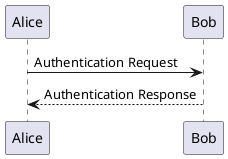

# Self-hosting a PlantUML server (intranet)

_[繁體中文版](./plantuml-server-setup.zh-TW.md)_

By default MD Reader Lite renders `plantuml` diagrams via the **public** `https://www.plantuml.com/plantuml` server. That means your diagram source is sent to a third party. For sensitive or corporate content, run your **own** PlantUML server on your intranet and point the extension at it — your diagrams never leave your network.

> Reminder: PlantUML is a network feature. It is **off by default** and is **force-disabled while Offline mode is on**. To use it, enable "PlantUML" in the extension's Plugins tab and turn Offline mode off.

## 1. Run the server (Docker, one command)

```bash
docker run -d --name plantuml -p 8080:8080 plantuml/plantuml-server:jetty
```

- The server now listens on port `8080`.
- Find your host's intranet IP (e.g. `192.168.1.50`) with `ip addr` / `ifconfig` / `ipconfig`.
- Verify in a browser: open `http://<intranet-ip>:8080/` — you should see the PlantUML server page.

To keep it running across reboots add `--restart unless-stopped`. To pin a version use a tag such as `plantuml/plantuml-server:jetty-v1.2024.7`.

## 2. Point the extension at it

1. Open the extension popup → **Plugins** tab.
2. Turn **Offline mode** off (General tab) and enable **PlantUML**.
3. In **PlantUML server** enter your server's base URL, e.g. `http://192.168.1.50:8080` (no trailing slash needed — it is normalized).

The extension builds diagram URLs as `<server>/svg/<encoded>`, so a base URL of `http://192.168.1.50:8080` produces `http://192.168.1.50:8080/svg/…`.

## 3. Verify

Open any `.md` with a `plantuml` code fence, or a `.puml` / `.plantuml` file, for example:



The diagram should render as an image served from your intranet server. Confirm in DevTools → Network that the image request goes to your IP, not to `plantuml.com`.

## Privacy note

- **Public server** (`plantuml.com`): convenient, but your diagram source is transmitted to and processed by a third party.
- **Self-hosted server**: diagram source stays inside your network; nothing reaches the public internet.
- Either way, MD Reader Lite itself adds no identifiers and keeps no logs — the request is a plain `` load performed by the browser. See [PRIVACY.md](../PRIVACY.md).

## Notes

- HTTP vs HTTPS: an `http://` intranet server works. If the document page is served over `https://`, the browser may block a mixed-content `http://` image; prefer serving the PlantUML server over HTTPS in that case, or view the document over `http://`/`file://`.
- Non-Docker installs (WAR on Tomcat/Jetty, or the PicoWeb jar) also work — set the server URL to wherever it listens.
