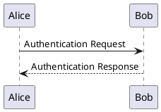

# 自架 PlantUML 伺服器（內網）

_[English version](./plantuml-server-setup.md)_

MD Reader Lite 預設用**公開的** `https://www.plantuml.com/plantuml` 伺服器算 `plantuml` 圖——這代表你的圖表原始碼會送到第三方。若內容敏感或屬公司資料，請在**內網自架** PlantUML 伺服器並讓擴充指向它，圖表就不會離開你的網路。

> 提醒：PlantUML 屬網路功能，**預設關閉**，且**離線模式開啟時強制停用**。要使用請在擴充的「插件」頁籤啟用 PlantUML，並把離線模式關掉。

## 1. 啟動伺服器（Docker，一行指令）

```bash
docker run -d --name plantuml -p 8080:8080 plantuml/plantuml-server:jetty
```

- 伺服器會監聽 `8080` 埠。
- 用 `ip addr` / `ifconfig` / `ipconfig` 查主機的內網 IP（例如 `192.168.1.50`）。
- 用瀏覽器驗證：開 `http://<內網IP>:8080/` 應看到 PlantUML 伺服器頁面。

想開機自動重啟加 `--restart unless-stopped`；想鎖版本用如 `plantuml/plantuml-server:jetty-v1.2024.7` 的 tag。

## 2. 讓擴充指向它

1. 開擴充 popup →「插件」頁籤。
2. 到「一般」把**離線模式**關掉，並啟用 **PlantUML**。
3. 在 **PlantUML 伺服器**填你的伺服器基底 URL，例如 `http://192.168.1.50:8080`（結尾斜線不必，會自動正規化）。

擴充會把圖表 URL 組成 `<伺服器>/svg/<編碼>`，所以基底 `http://192.168.1.50:8080` 會產生 `http://192.168.1.50:8080/svg/…`。

## 3. 驗證

開任一含 `plantuml` 程式碼區塊的 `.md`，或 `.puml` / `.plantuml` 檔，例如：



圖表應以你內網伺服器提供的圖片渲染。在 DevTools →「網路」確認圖片請求打到你的 IP、而非 `plantuml.com`。

## 隱私說明

- **公開伺服器**（`plantuml.com`）：方便，但圖表原始碼會傳送給第三方處理。
- **自架伺服器**：圖表原始碼留在你的網路內，不觸及公開網際網路。
- 無論哪種，MD Reader Lite 本身都不附帶識別碼、不留紀錄——請求只是瀏覽器載入一個 ``。詳見 [PRIVACY.md](../PRIVACY.md)。

## 注意事項

- HTTP 對 HTTPS：`http://` 內網伺服器可用。若文件頁面走 `https://`，瀏覽器可能封鎖混合內容的 `http://` 圖片；此時建議把 PlantUML 伺服器也架成 HTTPS，或以 `http://`／`file://` 開文件。
- 非 Docker 安裝（Tomcat/Jetty 上的 WAR、或 PicoWeb jar）同樣可用——把伺服器 URL 設成它實際監聽的位址即可。
